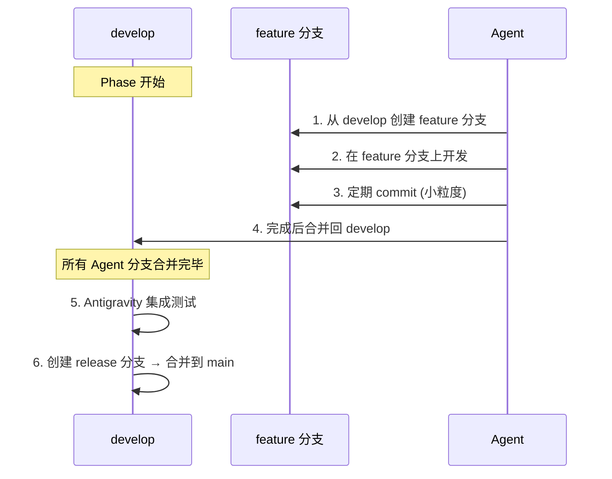

# AI Agent 协作契约 (CONTRACT.md)

> 本文件定义多 AI Agent 协同开发本项目时必须遵守的规范和约束。  
> 所有 Agent 在执行任务前**必须**阅读本文件。

---

## 1. 角色定义

| Agent | 角色 | 职责范围 |
|-------|------|---------|
| **Antigravity** | 架构师 & 项目经理 | 设计文档、API 契约、数据模型、DTO、配置类、Docker、集成协调 |
| **Codex** | 后端开发者 | Spring Boot 业务代码：Controller, Service, Repository, Common, Tests |
| **Gemini** | 前端开发者 | Vue 3 全部前端代码：页面、组件、路由、状态管理、样式 |

---

## 2. 文件权限规则

> [!CAUTION]  
> 违反文件权限是协作中最严重的问题。每个 Agent 只能修改自己拥有的文件。

**详细权限定义见 [OWNERSHIP.md](./OWNERSHIP.md)**。

核心原则：
1. **只修改自己拥有的文件**，不得越权
2. **引用他人文件时只读**，如需修改请在任务报告中提出请求
3. **新增文件**必须放在自己拥有的目录下
4. **共享文件**（如 `API_CONTRACT.md`）只有 Antigravity 可修改，其他 Agent 只读参考

---

## 3. 开发流程

### 3.1 任务接收

每个 Agent 收到任务时，必须：
1. 阅读 `CONTRACT.md`（本文件）
2. 阅读 `OWNERSHIP.md` 确认文件权限
3. 阅读 `docs/API_CONTRACT.md` 了解接口定义
4. 按任务描述中的**交付标准**完成工作

### 3.2 接口契约遵守

```
   Antigravity 定义 API_CONTRACT.md
         ↓                ↓
   Codex 按契约实现      Gemini 按契约对接
   后端 API              前端 API 调用
```

- **后端 (Codex)**：API 路径、请求/响应格式必须严格按 `API_CONTRACT.md` 实现
- **前端 (Gemini)**：API 调用必须严格按 `API_CONTRACT.md` 构造请求
- **如需修改契约**：在任务报告中向 Antigravity 提出修改建议，不得自行修改

### 3.3 Git 工作流规范

#### 3.3.1 分支策略 (Git Flow 变体)

```
main (生产分支)
 │
 ├── develop (开发主分支)
 │    │
 │    ├── feature/phase1-backend-paper-crud    ← Codex 后端功能分支
 │    ├── feature/phase1-frontend-paper-list   ← Gemini 前端功能分支
 │    ├── feature/phase1-arch-docker-setup     ← Antigravity 架构分支
 │    │
 │    └── bugfix/fix-paper-upload-error        ← Bug 修复分支
 │
 ├── release/v0.1.0   ← 发布分支 (从 develop 切出)
 └── hotfix/fix-critical-bug  ← 紧急修复 (从 main 切出)
```

| 分支 | 来源 | 合并到 | 说明 |
|------|------|--------|------|
| `main` | — | — | 生产环境代码，始终保持可部署状态 |
| `develop` | `main` | `main` | 开发集成分支，所有功能在此汇合 |
| `feature/*` | `develop` | `develop` | 功能开发分支，完成后合并回 develop |
| `bugfix/*` | `develop` | `develop` | Bug 修复分支 |
| `release/*` | `develop` | `main` + `develop` | 发布准备分支，仅做版本号/文档修改 |
| `hotfix/*` | `main` | `main` + `develop` | 紧急线上修复 |

#### 3.3.2 分支命名规范

```
feature/phase{N}-{agent}-{功能描述}

示例:
  feature/phase0-codex-backend-scaffold
  feature/phase0-gemini-frontend-scaffold
  feature/phase0-arch-docker-config
  feature/phase1-codex-paper-crud-api
  feature/phase1-gemini-paper-list-page
  bugfix/fix-cors-config
  hotfix/fix-db-connection-leak
```

#### 3.3.3 Commit Message 规范 (Conventional Commits)

```
<type>(<scope>): <subject>

[optional body]

[optional footer]
```

**Type 类型**:

| Type | 说明 | 示例 |
|------|------|------|
| `feat` | 新功能 | `feat(paper): add paper upload API` |
| `fix` | Bug 修复 | `fix(note): fix markdown rendering issue` |
| `docs` | 文档变更 | `docs: update API contract for phase 1` |
| `style` | 代码格式 | `style(frontend): fix indentation` |
| `refactor` | 重构 | `refactor(service): extract file upload logic` |
| `test` | 测试 | `test(paper): add unit tests for PaperService` |
| `chore` | 构建/工具 | `chore: update docker-compose config` |
| `perf` | 性能优化 | `perf(query): optimize paper list query` |

**Scope 范围**:
- 后端: `paper`, `note`, `tag`, `config`, `common`
- 前端: `frontend`, `ui`, `api`, `router`, `store`
- 架构: `docker`, `nginx`, `db`, `ci`

**规则**:
- Subject 使用英文，首字母小写，不加句号
- Body（可选）解释 why 而不是 what
- Breaking Change 在 footer 中标注：`BREAKING CHANGE: xxx`

#### 3.3.4 开发流程



**每个 Agent 的 Git 操作**:

1. **开始任务前**：从最新 `develop` 创建自己的 feature 分支
2. **开发过程中**：频繁 commit（每完成一个小功能点就 commit）
3. **任务完成后**：先 `git pull origin develop` 合并最新代码，解决冲突
4. **合并方式**：使用 `--no-ff`（保留合并记录）

```bash
# 创建功能分支
git checkout develop
git pull origin develop
git checkout -b feature/phase1-codex-paper-crud-api

# 开发中频繁 commit
git add .
git commit -m "feat(paper): implement paper entity and repository"
git commit -m "feat(paper): add paper create and list endpoints"
git commit -m "test(paper): add unit tests for PaperService"

# 完成后合并
git checkout develop
git pull origin develop
git merge --no-ff feature/phase1-codex-paper-crud-api
git push origin develop

# 清理分支
git branch -d feature/phase1-codex-paper-crud-api
```

#### 3.3.5 版本号 & Tag 规范

遵循 [Semantic Versioning](https://semver.org/)：`MAJOR.MINOR.PATCH`

| 版本 | 含义 | 示例 |
|------|------|------|
| `v0.1.0` | Phase 0 完成 (骨架) | 初始版本 |
| `v0.2.0` | Phase 1 完成 (论文管理) | 新功能 |
| `v0.2.1` | Phase 1 Bug 修复 | 补丁 |
| `v0.3.0` | Phase 2 完成 (实验数据) | 新功能 |
| `v1.0.0` | 首个正式发布版 | 里程碑 |

```bash
# 发布流程
git checkout main
git merge --no-ff release/v0.1.0
git tag -a v0.1.0 -m "Phase 0: project scaffold and docker deployment"
git push origin main --tags
```

#### 3.3.6 .gitignore 规则

```gitignore
# === Java / Maven ===
target/
*.class
*.jar
*.war

# === IDE ===
.idea/
*.iml
.vscode/
*.swp

# === Node / Frontend ===
node_modules/
frontend/dist/

# === Environment ===
.env
.env.local
.env.*.local

# === OS ===
.DS_Store
Thumbs.db

# === Application ===
uploads/          # 用户上传文件（不入版本控制）
logs/
*.log

# === Docker ===
pgdata/
redisdata/
```

> [!WARNING]  
> **绝对不要提交的内容**：`.env` 文件（含数据库密码等敏感信息）、`uploads/` 目录（用户上传文件）、`node_modules/`、`target/`。

---

## 4. 后端编码规范

### 4.1 项目配置

| 项目 | 值 |
|------|-----|
| Java 版本 | 17 |
| Spring Boot | 3.x |
| 构建工具 | Maven |
| 包根路径 | `com.changye.web` |

### 4.2 包结构

```
com.changye.web
├── WebApplication.java            # 主入口 (Antigravity)
├── config/                        # 配置类 (Antigravity)
│   ├── CorsConfig.java
│   └── WebMvcConfig.java
├── common/                        # 公共模块 (Codex)
│   ├── exception/
│   │   ├── BusinessException.java
│   │   └── GlobalExceptionHandler.java
│   └── util/
├── model/                         # 实体类 (Antigravity)
│   ├── Paper.java
│   ├── Note.java
│   ├── Tag.java
│   └── enums/
│       └── ReadingStatus.java
├── dto/                           # DTO (Antigravity)
│   ├── request/
│   │   ├── PaperCreateRequest.java
│   │   └── NoteCreateRequest.java
│   └── response/
│       ├── PaperResponse.java
│       └── NoteResponse.java
├── repository/                    # 数据访问 (Codex)
│   ├── PaperRepository.java
│   └── NoteRepository.java
├── service/                       # 业务逻辑 (Codex)
│   ├── PaperService.java
│   └── NoteService.java
└── controller/                    # REST 控制器 (Codex)
    ├── HealthController.java
    ├── PaperController.java
    └── NoteController.java
```

### 4.3 编码约定

- **Controller**：只做参数校验和路由，不含业务逻辑
- **Service**：所有业务逻辑在此层，使用 `@Transactional`
- **Repository**：继承 `JpaRepository`，复杂查询用 `@Query`
- **异常**：自定义 `BusinessException`，通过 `@RestControllerAdvice` 统一处理
- **返回值**：Controller 统一返回 `ResponseEntity<ApiResponse<T>>`
- **日志**：使用 `@Slf4j` (Lombok)，关键操作记录 INFO / ERROR 级别

### 4.4 统一响应封装

```java
public class ApiResponse<T> {
    private int code;
    private String message;
    private T data;
    private String timestamp;
}
```

---

## 5. 前端编码规范

### 5.1 项目配置

| 项目 | 值 |
|------|-----|
| 框架 | Vue 3 (Composition API) |
| 构建工具 | Vite |
| 语言 | TypeScript |
| UI 组件库 | Element Plus |
| 状态管理 | Pinia |
| HTTP 客户端 | Axios |
| Markdown 编辑器 | md-editor-v3 |

### 5.2 目录职责

| 目录 | 说明 | 命名规范 |
|------|------|---------|
| `api/` | API 调用封装 | `paper.ts`, `note.ts` |
| `components/` | 可复用组件 | PascalCase: `PaperCard.vue` |
| `composables/` | 组合式函数 | camelCase: `usePaperList.ts` |
| `pages/` | 页面视图 | kebab-case 目录: `papers/index.vue` |
| `stores/` | Pinia Store | camelCase: `paperStore.ts` |
| `types/` | TS 类型定义 | camelCase: `paper.ts` |

### 5.3 编码约定

- 使用 `<script setup lang="ts">` 语法
- API 调用统一通过 `api/` 目录的封装函数
- 与后端 DTO 对齐的 TypeScript interface 定义在 `types/`
- Element Plus 组件按需导入
- 所有页面组件必须有唯一 ID 用于测试

---

## 6. API 对接规范

### 6.1 前端 Axios 配置

```typescript
// 基础配置
const instance = axios.create({
  baseURL: '/api/v1',
  timeout: 15000,
  headers: { 'Content-Type': 'application/json' }
});

// 响应拦截器统一处理错误
instance.interceptors.response.use(
  (res) => res.data,
  (err) => { /* 统一错误提示 */ }
);
```

### 6.2 Mock 数据策略

前端开发时，在后端未完成前使用 Mock 数据：
- 使用 `vite-plugin-mock` 或 MSW (Mock Service Worker)
- Mock 数据格式必须严格遵守 `API_CONTRACT.md` 中的响应格式
- 后端就绪后，切换到真实 API（仅需修改 baseURL 或关闭 mock 插件）

---

## 7. 沟通协议

### 7.1 需要向 Antigravity 请求的事项

- 修改 API 契约
- 修改数据模型 / DTO
- 新增数据库表
- 修改 Docker 配置
- 跨模块依赖变更

### 7.2 任务完成报告

每个 Agent 完成任务后，需提供：
1. ✅ 已完成的工作清单
2. ⚠️ 遇到的问题或偏离契约的地方
3. 💡 对后续开发的建议
4. 📝 新增/修改的文件列表
