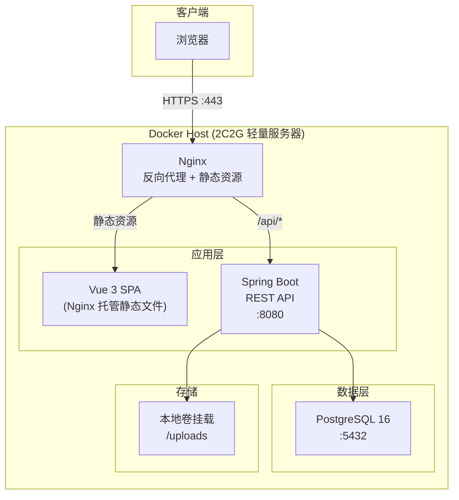
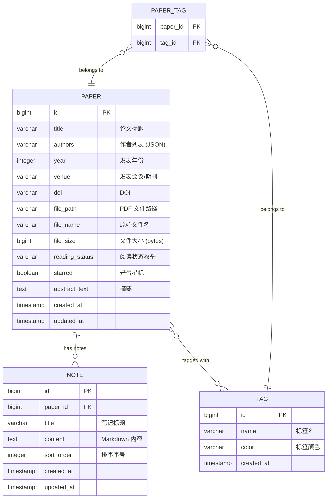
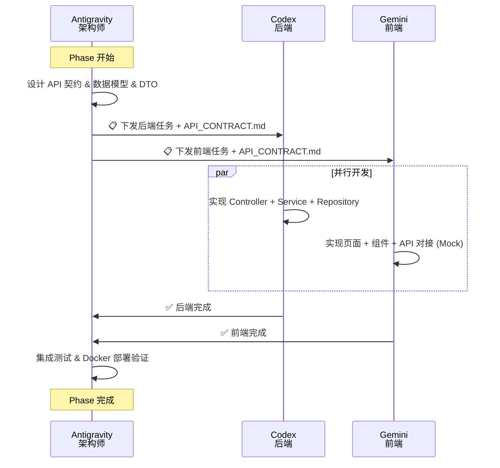

# ChangYe 个人科研工具网站 — 设计文档

> **版本**: v0.2  
> **日期**: 2026-02-13  
> **状态**: ✅ 已确认

---

## 1. 项目概述

### 1.1 目标

构建一个**可持续扩展的个人科研工具平台**，部署在轻量化服务器（2C2G）上，用于承载个人科研中常用的各类小工具。项目同时作为 Vibe Coding 实践场，使用多种 AI Coding 工具协同开发，积累不同技术栈的开发经验。

### 1.2 核心技术栈

| 层级 | 技术 | 说明 |
|------|------|------|
| **后端** | Spring Boot 3.x (Java 17) | RESTful API, Maven 构建 |
| **前端** | Vue 3 + Vite + TypeScript | Element Plus UI 组件库, Pinia + Vue Router |
| **数据库** | PostgreSQL 16 | 主数据库，初期开发可用 H2 |
| **缓存** | Redis 7 | **后期引入**，初期不启用 |
| **部署** | Docker + Docker Compose | Nginx 反向代理 + HTTPS (Let's Encrypt) |
| **CI/CD** | 手动部署 | 初期 `docker-compose` 手动部署，后续可引入 GitHub Actions |

### 1.3 AI 协同开发分工

```
┌─────────────────────────────────────────────────────────┐
│                    Antigravity                            │
│            🏗️ 整体架构设计 & 项目管理                      │
│   - 设计文档维护        - 接口契约 (API Contract) 定义    │
│   - 模块拆分 & 任务分配  - 代码审查 & 集成协调             │
│   - Docker/部署配置     - 数据库 Schema 设计              │
└──────────────┬──────────────────────┬────────────────────┘
               │                      │
       ┌───────▼───────┐      ┌───────▼───────┐
       │    Codex       │      │    Gemini      │
       │ 🔧 后端开发     │      │ 🎨 前端开发     │
       │ Spring Boot    │      │ Vue 3 + TS     │
       │ API 实现       │      │ 页面 & 组件     │
       │ 业务逻辑       │      │ Element Plus   │
       │ 数据层         │      │ API 对接       │
       └───────────────┘      └───────────────┘
```

---

## 2. 项目结构

```
personal_web/
├── docs/                          # 文档目录
│   ├── API_CONTRACT.md            # 接口契约文档
│   └── CHANGELOG.md               # 变更日志
│
├── backend/                       # Spring Boot 后端
│   ├── src/
│   │   ├── main/
│   │   │   ├── java/com/changye/web/
│   │   │   │   ├── WebApplication.java
│   │   │   │   ├── config/            # 配置类 (CORS, Security, etc.)
│   │   │   │   ├── controller/        # REST 控制器
│   │   │   │   ├── service/           # 业务逻辑层
│   │   │   │   ├── repository/        # 数据访问层
│   │   │   │   ├── model/             # 实体类
│   │   │   │   ├── dto/               # 数据传输对象
│   │   │   │   └── common/            # 公共工具类、异常处理
│   │   │   └── resources/
│   │   │       ├── application.yml     # 主配置
│   │   │       ├── application-dev.yml # 开发环境配置
│   │   │       └── application-prod.yml# 生产环境配置
│   │   └── test/                      # 单元测试 & 集成测试
│   ├── pom.xml                        # Maven 依赖管理
│   └── Dockerfile                     # 后端容器构建
│
├── frontend/                      # Vue 3 前端
│   ├── src/
│   │   ├── api/                   # API 调用封装 (axios)
│   │   ├── assets/                # 静态资源
│   │   ├── components/            # 公共组件
│   │   │   └── MdEditor/          # Markdown 编辑器组件
│   │   ├── composables/           # 组合式函数
│   │   ├── layouts/               # 布局组件
│   │   ├── pages/                 # 页面视图 (按功能模块)
│   │   │   ├── home/
│   │   │   └── papers/            # 论文管理页面
│   │   ├── router/                # 路由配置
│   │   ├── stores/                # Pinia 状态管理
│   │   ├── styles/                # 全局样式
│   │   ├── types/                 # TypeScript 类型定义
│   │   ├── App.vue
│   │   └── main.ts
│   ├── public/
│   ├── index.html
│   ├── package.json
│   ├── vite.config.ts
│   ├── tsconfig.json
│   └── Dockerfile                 # 前端容器构建 (Nginx)
│
├── uploads/                       # 文件上传挂载卷 (论文 PDF 等)
│   └── papers/
│
├── docker-compose.yml             # 编排文件 (生产)
├── docker-compose.dev.yml         # 开发环境编排
├── nginx/                         # Nginx 配置
│   └── conf.d/
│       └── default.conf
├── .env.example                   # 环境变量模板
├── CONTRACT.md                    # AI Agent 协作契约
├── OWNERSHIP.md                   # 文件权限 & 所有权声明
├── DESIGN.md                      # 设计文档 (本文件)
└── README.md                      # 项目说明
```

---

## 3. 系统架构

### 3.1 整体架构图



### 3.2 请求流程

```
浏览器 → Nginx (:443)
  ├── 静态资源请求 → 直接返回 Vue 构建产物
  ├── /api/* 请求  → 反向代理到 Spring Boot (:8080)
  │                   ├── Controller (参数校验 + 路由)
  │                   ├── Service (业务逻辑)
  │                   ├── Repository (数据访问)
  │                   └── PostgreSQL
  └── /uploads/*   → 反向代理或直接由 Nginx 提供静态文件
```

---

## 4. 模块规划 (渐进式)

> 项目会持续演进，以下按**阶段**规划核心模块。每个阶段都是可独立交付的增量。

### Phase 0: 基础骨架 🏗️

**目标**：搭建项目脚手架，打通前后端联调 + Docker 部署流水线。

| 任务 | 负责 Agent | 内容 |
|------|-----------|------|
| 后端脚手架 | Codex | Spring Boot 初始化 (Maven, Java 17)、CORS 配置、Health Check API |
| 前端脚手架 | Gemini | Vue 3 + Vite + Element Plus 项目初始化、路由配置、布局组件 |
| 接口契约 | Antigravity | 定义 `API_CONTRACT.md`，约定 `/api/v1/health` |
| Docker 配置 | Antigravity | `docker-compose.yml`、Nginx 配置、Dockerfile |
| 协作文档 | Antigravity | `CONTRACT.md` + `OWNERSHIP.md` |

**交付标准**：`docker-compose up` 一键启动，浏览器可见首页 + Health API 可调通。

---

### Phase 1: 论文管理系统 📚

**目标**：构建一个类语雀的论文管理 + 阅读笔记系统，支持论文上传、阅读状态管理、Markdown 笔记编辑。

#### 4.1.1 功能清单

| 功能模块 | 说明 |
|---------|------|
| **论文上传** | 支持 PDF 文件上传，存储到服务器本地卷 |
| **论文列表** | 分页展示所有论文，支持搜索/筛选 |
| **阅读状态管理** | 灵活的状态标签：未读 / 读了一点 / 读了一半 / 精读完成 / 需要重读 |
| **论文详情** | 查看论文元信息（标题、作者、年份、关键词、来源等） |
| **Markdown 笔记** | 每篇论文可附加多篇 Markdown 笔记，内嵌 MD 编辑器（参考语雀风格） |
| **标签系统** | 自定义标签对论文分类（如：NLP、安全、网络等） |
| **收藏/星标** | 重要论文可标星快速检索 |

#### 4.1.2 数据模型



#### 4.1.3 阅读状态枚举

```java
public enum ReadingStatus {
    UNREAD("未读"),
    SKIMMED("读了一点"),
    HALF_READ("读了一半"),
    FINISHED("精读完成"),
    NEED_REREAD("需要重读");
}
```

#### 4.1.4 前端页面设计

| 页面 | 路由 | 说明 |
|------|------|------|
| 论文列表 | `/papers` | 卡片/表格视图切换，筛选栏 (状态/标签/搜索) |
| 论文详情 | `/papers/:id` | 左侧元信息 + 右侧笔记列表，类语雀布局 |
| 笔记编辑 | `/papers/:id/notes/:noteId` | 全屏 Markdown 编辑器，实时预览 |
| 标签管理 | `/tags` | 标签 CRUD，可自定义颜色 |

**Markdown 编辑器技术选型**：推荐 [md-editor-v3](https://github.com/imzbf/md-editor-v3)（Vue 3 适配、功能丰富、类语雀体验）。

---

### Phase 2: 实验数据记录 🔬

**目标**：记录和管理科研实验数据、结果和配置。

| 功能 | 说明 |
|------|------|
| 实验项目管理 | 创建实验项目，关联论文 |
| 实验运行记录 | 记录每次实验的超参数、指标、日志 |
| 数据可视化 | ECharts 图表展示实验结果趋势 |
| 配置管理 | 保存和对比不同实验配置 |

> [!NOTE]  
> Phase 2 的详细设计将在 Phase 1 完成后展开。

---

### Phase 3+: 进阶功能 🚀

- **用户认证**（Spring Security + JWT），仅自己可访问管理功能
- **Redis 缓存**（论文列表缓存、热点数据加速）
- **文件存储优化**（MinIO 对象存储）
- **定时任务**（Spring Scheduler，如论文库自动同步）
- **更多科研工具**（按需添加）

---

## 5. AI Agent 协作规范

### 5.1 文件权限划分 (OWNERSHIP)

为避免多 Agent 同时修改同一文件导致冲突，严格划分所有权：

```
Antigravity (架构师):
  ✅ DESIGN.md, API_CONTRACT.md, CONTRACT.md, OWNERSHIP.md
  ✅ docker-compose.yml, docker-compose.dev.yml, .env.example
  ✅ nginx/, docs/
  ✅ backend/src/.../config/     (CORS, Security 等配置类)
  ✅ backend/src/.../model/      (实体类定义)
  ✅ backend/src/.../dto/        (DTO 定义)
  ❌ 不可修改前端和后端业务代码

Codex (后端):
  ✅ backend/src/.../controller/
  ✅ backend/src/.../service/
  ✅ backend/src/.../repository/
  ✅ backend/src/.../common/
  ✅ backend/src/test/
  ✅ backend/pom.xml, backend/Dockerfile
  ❌ 不可修改 config/, model/, dto/ (只读引用)
  ❌ 不可修改前端代码

Gemini (前端):
  ✅ frontend/ 下所有文件
  ❌ 不可修改后端代码
  ❌ 不可修改项目根目录文档

共享只读:
  📖 API_CONTRACT.md    — 所有 Agent 只读参考
  📖 OWNERSHIP.md       — 所有 Agent 只读参考
  📖 backend/.../dto/   — Codex & Gemini 只读参考（前端需对齐类型）
```

### 5.2 并行开发流程



### 5.3 Agent 任务下发模板

```markdown
## 任务: [Phase X] [任务名称]

### 上下文
- 参考文档: API_CONTRACT.md (Section X)
- 依赖: [列出依赖的文件或模块]

### 具体要求
1. [具体任务描述]

### 约束
- 遵守 OWNERSHIP.md 中的文件权限
- 遵守 CONTRACT.md 中的代码规范

### 交付标准
- [ ] [验收条件]
```

---

## 6. 接口规范 (概要)

### 6.1 通用约定

| 项目 | 约定 |
|------|------|
| Base URL | `/api/v1` |
| 数据格式 | JSON (UTF-8) |
| 认证方式 | Phase 0-1: 无认证；Phase 3+: JWT Bearer Token |
| 时间格式 | ISO 8601 (`2026-02-13T19:55:23+08:00`) |
| 分页参数 | `?page=0&size=20&sort=createdAt,desc` |
| 文件上传 | `multipart/form-data` |

### 6.2 统一响应格式

```json
// 成功
{ "code": 200, "message": "success", "data": { }, "timestamp": "..." }

// 分页
{ "code": 200, "message": "success", "data": {
    "content": [...],
    "page": 0, "size": 20, "totalElements": 100, "totalPages": 5
  }, "timestamp": "..." }

// 错误
{ "code": 400, "message": "参数校验失败", "data": null, "timestamp": "..." }
```

### 6.3 Phase 1 接口概要

| Method | Path | 说明 |
|--------|------|------|
| GET | `/api/v1/health` | 健康检查 |
| GET | `/api/v1/papers` | 论文列表 (分页/筛选) |
| POST | `/api/v1/papers` | 新增论文 (上传 PDF + 元数据) |
| GET | `/api/v1/papers/{id}` | 论文详情 |
| PUT | `/api/v1/papers/{id}` | 更新论文信息 |
| PATCH | `/api/v1/papers/{id}/status` | 更新阅读状态 |
| PATCH | `/api/v1/papers/{id}/star` | 切换星标 |
| DELETE | `/api/v1/papers/{id}` | 删除论文 |
| GET | `/api/v1/papers/{id}/notes` | 获取笔记列表 |
| POST | `/api/v1/papers/{id}/notes` | 新增笔记 |
| PUT | `/api/v1/notes/{noteId}` | 更新笔记 |
| DELETE | `/api/v1/notes/{noteId}` | 删除笔记 |
| GET | `/api/v1/tags` | 标签列表 |
| POST | `/api/v1/tags` | 新增标签 |
| PUT | `/api/v1/tags/{id}` | 更新标签 |
| DELETE | `/api/v1/tags/{id}` | 删除标签 |

> [!TIP]  
> 详细接口定义（请求体/响应体/参数）在 `docs/API_CONTRACT.md` 中维护。

---

## 7. 部署架构

### 7.1 Docker Compose 编排 (初期，无 Redis)

```yaml
services:
  nginx:
    image: nginx:alpine
    ports:
      - "80:80"
      - "443:443"
    volumes:
      - ./nginx/conf.d:/etc/nginx/conf.d
      - ./certbot/conf:/etc/letsencrypt
      - frontend-dist:/usr/share/nginx/html
    depends_on:
      - backend

  backend:
    build: ./backend
    expose:
      - "8080"
    environment:
      - SPRING_PROFILES_ACTIVE=prod
      - DB_HOST=postgres
    volumes:
      - ./uploads:/app/uploads      # 论文 PDF 存储
    depends_on:
      - postgres

  postgres:
    image: postgres:16-alpine
    volumes:
      - pgdata:/var/lib/postgresql/data
    environment:
      - POSTGRES_DB=personal_web
      - POSTGRES_USER=${DB_USER}
      - POSTGRES_PASSWORD=${DB_PASSWORD}

volumes:
  pgdata:
  frontend-dist:
```

### 7.2 资源规划 (2C2G 服务器)

| 服务 | 内存预估 | 说明 |
|------|---------|------|
| Nginx | ~10 MB | 静态文件服务 + 反向代理 |
| Spring Boot | ~300-400 MB | JVM: `-Xmx384m -Xms128m` |
| PostgreSQL | ~100-150 MB | 数据量小时开销低 |
| OS + 其他 | ~200 MB | 系统占用 |
| **总计** | **~610-760 MB** | 2G 内存充裕，后期可加 Redis (~30MB) |

> [!IMPORTANT]  
> JVM 参数必须在 Dockerfile 或 docker-compose 中显式设置 `-Xmx384m`，避免 JVM 默认占满内存。

---

## 8. 开发规范

### 8.1 后端规范 (Spring Boot)

- **Java 版本**：Java 17
- **构建工具**：Maven
- **包结构**：`com.changye.web.{module}.{layer}`（如 `com.changye.web.paper.controller`）
- **异常处理**：全局 `@RestControllerAdvice` + 自定义业务异常
- **日志**：SLF4J + Logback
- **数据库迁移**：Flyway
- **测试**：Controller → MockMvc，Service → Mockito

### 8.2 前端规范 (Vue 3)

- **UI 组件库**：Element Plus
- **命名**：组件 PascalCase，文件 kebab-case，Composable 以 `use` 开头
- **状态管理**：Pinia Store 按功能模块拆分
- **API 封装**：统一 axios 实例 + 请求/响应拦截器
- **Markdown 编辑器**：md-editor-v3
- **样式**：Element Plus 主题定制 + Scoped CSS

### 8.3 Git 工作流

**分支策略** (Git Flow 变体)：

```
main ← 生产环境，始终可部署
  └── develop ← 开发集成分支
        ├── feature/phase{N}-{agent}-{功能} ← 功能开发
        ├── bugfix/{描述}                   ← Bug 修复
        └── release/v{X.Y.Z}               ← 发布准备
```

**Commit 规范** (Conventional Commits)：

```
feat(paper): add paper upload API
fix(note): fix markdown rendering issue
docs: update API contract
chore: update docker config
test(paper): add service unit tests
refactor(service): extract upload logic
```

**版本号** (Semantic Versioning)：

| Tag | 含义 |
|-----|------|
| `v0.1.0` | Phase 0 完成 |
| `v0.2.0` | Phase 1 完成 |
| `v1.0.0` | 首个正式发布 |

> 完整 Git 工作流规范见 [CONTRACT.md](./CONTRACT.md) Section 3.3。

---

## 附录: 已确认决策记录

| # | 问题 | 决策 |
|---|------|------|
| 1 | 服务器配置 | 已有域名和服务器，2C2G |
| 2 | 前端 UI 库 | Element Plus |
| 3 | 数据库 | PostgreSQL |
| 4 | Phase 1 内容 | 论文管理 (上传/阅读状态/MD笔记) |
| 5 | 优先工具 | 论文管理 → 实验数据记录 |
| 6 | 构建工具 | Maven |
| 7 | Java 版本 | 17 |
| 8 | CI/CD | 初期手动部署 |
| 9 | Redis | 后期引入 |
